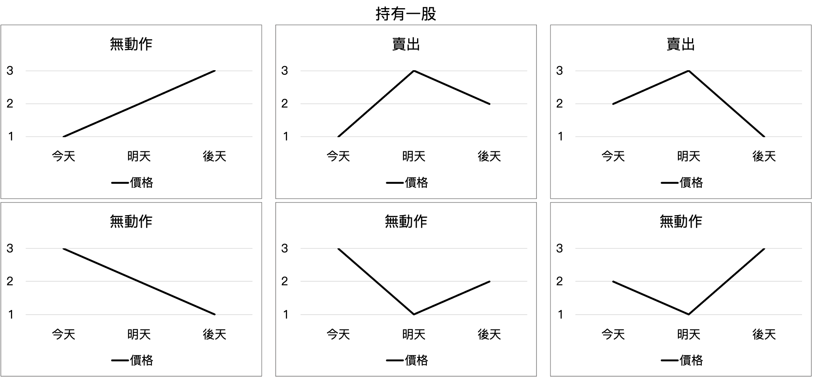

# Auto_Trading

#### [DSAI_HW2-Auto_Trading](https://docs.google.com/document/d/178uDDUq_5UD7MaNghHdJGPW97_w2HJ8rDYxUXRWv36w/edit#heading=h.5ec4624ic8t4)

---
test the code by running 

```python trader.py --training "Training Data" -- testing "Testing Data" --output output.csv```

---
## Method 1 - 支持向量迴歸 (Support Vector Regression, SVR)
SVR_1：找到某一個超平面，使所有的樣本點離超平面的偏差總和最小化，並預測未來一天之開盤價。

### Framework 1


----

## Method 2 - 支持向量迴歸 (Support Vector Regression, SVR)
SVR_2：找到某一個超平面，使所有的樣本點離超平面的偏差總和最小化，並預測未來兩天之開盤價。

### Framework 2


---

### Data analysis
* 三種狀態：沒有持股、持有一股、做空一股
* 三種動作：買入、無動作、賣出（沒有持股時執行賣出動作為做空）





---

### Data pre-processing
取出開盤價，用以預測未來的開盤價
